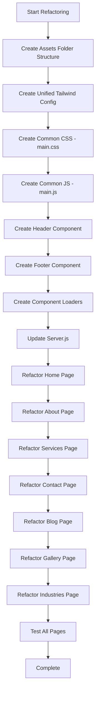

# Flame Logistics - Atomic Structure Refactoring Plan

## Overview

This plan outlines the refactoring of the Flame Logistics frontend to implement an **atomic design structure** with:
- Centralized CSS and JS assets
- Common header and footer components
- Consistent styling based on the home page design system

## Current State Analysis

### Pages Identified
Located in `frontend/pages/desktop/`:
1. `home.html` - **Reference page for styling**
2. `about.html`
3. `services.html`
4. `contact.html`
5. `blog.html`
6. `gallery.html`
7. `industries.html`

### Current Issues
- Each page has its own inline Tailwind config with slight variations
- Each page has its own inline `<style>` block
- Each page has its own inline `<script>` block
- Header and footer are duplicated across all pages
- Inconsistent color definitions between pages
- No shared asset files

## Proposed Atomic Structure

```
frontend/
├── assets/
│   ├── css/
│   │   ├── main.css              # Common styles for all pages
│   │   ├── components/
│   │   │   ├── header.css        # Header-specific styles
│   │   │   ├── footer.css        # Footer-specific styles
│   │   │   └── buttons.css       # Button styles
│   │   └── pages/
│   │       ├── home.css          # Home page specific styles
│   │       ├── about.css         # About page specific styles
│   │       ├── services.css      # Services page specific styles
│   │       ├── contact.css       # Contact page specific styles
│   │       ├── blog.css          # Blog page specific styles
│   │       ├── gallery.css       # Gallery page specific styles
│   │       └── industries.css    # Industries page specific styles
│   └── js/
│       ├── tailwind.config.js    # Unified Tailwind configuration
│       ├── main.js               # Common JavaScript functionality
│       └── components/
│           ├── header.js         # Header component loader
│           └── footer.js         # Footer component loader
├── components/
│   ├── header.html               # Reusable header HTML
│   └── footer.html               # Reusable footer HTML
├── pages/
│   └── desktop/
│       ├── home.html
│       ├── about.html
│       ├── services.html
│       ├── contact.html
│       ├── blog.html
│       ├── gallery.html
│       └── industries.html
└── server.js
```

## Unified Design System (Based on Home Page)

### Color Palette
```javascript
colors: {
  // Primary Colors
  "primary": "#09005d",
  "primary-container": "#1e197d",
  "on-primary": "#ffffff",
  "on-primary-container": "#8988eb",
  
  // Secondary Colors (Flame Red)
  "secondary": "#bc000c",
  "secondary-container": "#e80f16",
  "on-secondary": "#ffffff",
  "on-secondary-container": "#fffbff",
  "on-secondary-fixed-variant": "#930007",
  
  // Tertiary Colors
  "tertiary": "#151719",
  "tertiary-container": "#2a2b2e",
  "on-tertiary": "#ffffff",
  "on-tertiary-container": "#919295",
  
  // Surface Colors
  "surface": "#fcf8ff",
  "surface-bright": "#fcf8ff",
  "surface-dim": "#dcd8e1",
  "surface-container": "#f0ecf5",
  "surface-container-low": "#f6f2fb",
  "surface-container-high": "#eae7f0",
  "surface-container-highest": "#e4e1ea",
  "surface-container-lowest": "#ffffff",
  "surface-variant": "#e4e1ea",
  "surface-tint": "#5453b2",
  
  // Background
  "background": "#fcf8ff",
  "on-background": "#1b1b21",
  "on-surface": "#1b1b21",
  "on-surface-variant": "#464552",
  
  // Outline
  "outline": "#777683",
  "outline-variant": "#c7c5d4",
  
  // Error
  "error": "#ba1a1a",
  "error-container": "#ffdad6",
  "on-error": "#ffffff",
  "on-error-container": "#93000a",
  
  // Inverse
  "inverse-surface": "#303036",
  "inverse-on-surface": "#f3eff8",
  "inverse-primary": "#c2c1ff",
  
  // Fixed Colors
  "primary-fixed": "#e2dfff",
  "primary-fixed-dim": "#c2c1ff",
  "secondary-fixed": "#ffdad5",
  "secondary-fixed-dim": "#ffb4aa",
  "tertiary-fixed": "#e2e2e5",
  "tertiary-fixed-dim": "#c6c6c9",
  "on-primary-fixed": "#0c006a",
  "on-primary-fixed-variant": "#3b3a99",
  "on-secondary-fixed": "#410001",
  "on-tertiary-fixed": "#1a1c1e",
  "on-tertiary-fixed-variant": "#45474a"
}
```

### Typography
```javascript
fontFamily: {
  "label-md": ["Inter"],
  "title-lg": ["Plus Jakarta Sans"],
  "display-lg-mobile": ["Plus Jakarta Sans"],
  "body-sm": ["Inter"],
  "body-md": ["Inter"],
  "body-lg": ["Inter"],
  "headline-sm": ["Plus Jakarta Sans"],
  "display-lg": ["Plus Jakarta Sans"],
  "headline-md": ["Plus Jakarta Sans"]
}

fontSize: {
  "label-md": ["12px", {lineHeight: "16px", letterSpacing: "0.05em", fontWeight: "600"}],
  "title-lg": ["20px", {lineHeight: "28px", fontWeight: "600"}],
  "display-lg-mobile": ["32px", {lineHeight: "40px", letterSpacing: "-0.01em", fontWeight: "700"}],
  "body-sm": ["14px", {lineHeight: "20px", fontWeight: "400"}],
  "body-md": ["16px", {lineHeight: "24px", fontWeight: "400"}],
  "body-lg": ["18px", {lineHeight: "28px", fontWeight: "400"}],
  "headline-sm": ["24px", {lineHeight: "32px", fontWeight: "600"}],
  "display-lg": ["48px", {lineHeight: "56px", letterSpacing: "-0.02em", fontWeight: "700"}],
  "headline-md": ["32px", {lineHeight: "40px", fontWeight: "600"}]
}
```

### Spacing
```javascript
spacing: {
  "margin-mobile": "16px",
  "container-max": "1280px",
  "margin-desktop": "40px",
  "base": "8px",
  "gutter": "24px"
}
```

### Border Radius
```javascript
borderRadius: {
  "DEFAULT": "0.25rem",
  "lg": "0.5rem",
  "xl": "0.75rem",
  "full": "9999px"
}
```

## Common Header Component

The header will be standardized across all pages with:
- Fixed positioning at top
- Logo linking to home
- Navigation links with active state highlighting
- "Get a Quote" CTA button

```html
<header class="fixed top-0 w-full z-50 bg-surface/90 backdrop-blur-md border-b border-outline-variant/30 shadow-sm">
  <div class="max-w-container-max mx-auto px-margin-desktop flex justify-between items-center h-20">
    <a class="font-display-lg text-headline-sm font-bold text-primary tracking-tight" href="home.html">
      Flame Logistics
    </a>
    <nav class="hidden md:flex gap-8 items-center" id="main-nav">
      <a class="nav-link" href="home.html" data-page="home">Home</a>
      <a class="nav-link" href="industries.html" data-page="industries">Industries</a>
      <a class="nav-link" href="services.html" data-page="services">Services</a>
      <a class="nav-link" href="gallery.html" data-page="gallery">Gallery</a>
      <a class="nav-link" href="blog.html" data-page="blog">Blog</a>
      <a class="nav-link" href="about.html" data-page="about">About Us</a>
      <a class="nav-link" href="contact.html" data-page="contact">Contact</a>
      <a class="nav-link" href="../admin.html" data-page="admin">Admin</a>
    </nav>
    <a href="contact.html" class="bg-secondary text-on-secondary px-6 py-2.5 rounded-xl font-bold hover:opacity-80 transition-all active:scale-95 inline-block">
      Get a Quote
    </a>
  </div>
</header>
```

## Common Footer Component

The footer will be standardized with:
- Company branding
- Platform links
- Company links
- Contact information
- Social media links
- Copyright notice

## Common CSS Styles (main.css)

```css
/* Material Symbols */
.material-symbols-outlined {
  font-variation-settings: 'FILL' 0, 'wght' 400, 'GRAD' 0, 'opsz' 24;
}

/* Reveal Animation */
.reveal {
  opacity: 0;
  transform: translateY(30px);
  transition: all 0.8s cubic-bezier(0.2, 1, 0.3, 1);
}

.reveal.active {
  opacity: 1;
  transform: translateY(0);
}

/* Navigation Scrolled State */
.nav-scrolled {
  background-color: rgba(255, 255, 255, 0.95) !important;
  backdrop-filter: blur(8px);
  border-bottom: 1px solid rgba(229, 231, 235, 0.5);
  box-shadow: 0 4px 6px -1px rgb(0 0 0 / 0.1);
}

/* Navigation Links */
.nav-link {
  @apply font-label-md text-label-md text-on-surface hover:text-primary transition-colors;
}

.nav-link.active {
  @apply text-secondary font-bold border-b-2 border-secondary pb-1;
}

/* Glass Effect */
.glass-effect {
  backdrop-filter: blur(12px);
  background: rgba(255, 255, 255, 0.05);
  border: 1px solid rgba(255, 255, 255, 0.1);
}

/* Hero Gradient */
.hero-gradient {
  background: linear-gradient(to right, rgba(9, 0, 93, 0.8) 0%, rgba(9, 0, 93, 0.4) 50%, transparent 100%);
}

/* Service Card Shadow */
.service-card-shadow {
  box-shadow: 0 10px 40px -10px rgba(9, 0, 93, 0.05);
}

.service-card:hover {
  transform: translateY(-8px);
  box-shadow: 0 20px 50px -12px rgba(9, 0, 93, 0.12);
}

/* Hover Lift Effect */
.hover-lift {
  transition: transform 0.3s cubic-bezier(0.34, 1.56, 0.64, 1), box-shadow 0.3s ease;
}

.hover-lift:hover {
  transform: translateY(-6px);
  box-shadow: 0px 12px 30px rgba(30, 25, 125, 0.08);
}
```

## Common JavaScript (main.js)

```javascript
// Reveal animation on scroll
function reveal() {
  var reveals = document.querySelectorAll(".reveal");
  for (var i = 0; i < reveals.length; i++) {
    var windowHeight = window.innerHeight;
    var elementTop = reveals[i].getBoundingClientRect().top;
    var elementVisible = 150;
    if (elementTop < windowHeight - elementVisible) {
      reveals[i].classList.add("active");
    }
  }
}

window.addEventListener("scroll", reveal);
reveal(); // Trigger once on load

// Navigation scroll effect
window.addEventListener('scroll', () => {
  const header = document.querySelector('header');
  if (window.scrollY > 50) {
    header.classList.add('nav-scrolled');
  } else {
    header.classList.remove('nav-scrolled');
  }
});

// Set active navigation link based on current page
function setActiveNavLink() {
  const currentPage = window.location.pathname.split('/').pop().replace('.html', '') || 'home';
  const navLinks = document.querySelectorAll('.nav-link');
  navLinks.forEach(link => {
    const linkPage = link.getAttribute('data-page');
    if (linkPage === currentPage) {
      link.classList.add('active');
    } else {
      link.classList.remove('active');
    }
  });
}

document.addEventListener('DOMContentLoaded', setActiveNavLink);
```

## Component Loading Strategy

Since this is a static HTML site served by Express, we'll use JavaScript to dynamically load header and footer components:

```javascript
// components/header.js
async function loadHeader() {
  const response = await fetch('/components/header.html');
  const html = await response.text();
  document.getElementById('header-placeholder').innerHTML = html;
  setActiveNavLink();
}

// components/footer.js
async function loadFooter() {
  const response = await fetch('/components/footer.html');
  const html = await response.text();
  document.getElementById('footer-placeholder').innerHTML = html;
}

// Initialize components
document.addEventListener('DOMContentLoaded', () => {
  loadHeader();
  loadFooter();
});
```

## Page Template Structure

Each page will follow this structure:

```html
<!DOCTYPE html>
<html class="scroll-smooth" lang="en">
<head>
  <meta charset="utf-8">
  <meta content="width=device-width, initial-scale=1.0" name="viewport">
  <title>Page Title | Flame Logistics</title>
  
  <!-- Tailwind CSS -->
  <script src="https://cdn.tailwindcss.com?plugins=forms,container-queries"></script>
  
  <!-- Google Fonts -->
  <link href="https://fonts.googleapis.com/css2?family=Inter:wght@400;500;600&family=Plus+Jakarta+Sans:wght@600;700;800&family=Material+Symbols+Outlined:wght,FILL@100..700,0..1&display=swap" rel="stylesheet">
  
  <!-- Unified Tailwind Config -->
  <script src="/assets/js/tailwind.config.js"></script>
  
  <!-- Common Styles -->
  <link rel="stylesheet" href="/assets/css/main.css">
  
  <!-- Page-specific Styles (if needed) -->
  <link rel="stylesheet" href="/assets/css/pages/[page-name].css">
</head>
<body class="bg-background text-on-background font-body-md selection:bg-secondary/30">
  
  <!-- Header Placeholder -->
  <div id="header-placeholder"></div>
  
  <main>
    <!-- Page Content -->
  </main>
  
  <!-- Footer Placeholder -->
  <div id="footer-placeholder"></div>
  
  <!-- Common Scripts -->
  <script src="/assets/js/main.js"></script>
  <script src="/assets/js/components/header.js"></script>
  <script src="/assets/js/components/footer.js"></script>
  
  <!-- Page-specific Scripts (if needed) -->
  <script src="/assets/js/pages/[page-name].js"></script>
</body>
</html>
```

## Server.js Updates

Update the Express server to serve the new assets and components:

```javascript
// Add static serving for assets and components
app.use('/assets', express.static(path.join(__dirname, 'assets')));
app.use('/components', express.static(path.join(__dirname, 'components')));
```

## Implementation Flow Diagram



## Files to Create

1. `frontend/assets/css/main.css` - Common styles
2. `frontend/assets/css/pages/home.css` - Home-specific styles (marquee animation)
3. `frontend/assets/css/pages/about.css` - About-specific styles
4. `frontend/assets/css/pages/services.css` - Services-specific styles
5. `frontend/assets/css/pages/contact.css` - Contact-specific styles
6. `frontend/assets/css/pages/blog.css` - Blog-specific styles
7. `frontend/assets/css/pages/gallery.css` - Gallery-specific styles
8. `frontend/assets/css/pages/industries.css` - Industries-specific styles
9. `frontend/assets/js/tailwind.config.js` - Unified Tailwind configuration
10. `frontend/assets/js/main.js` - Common JavaScript
11. `frontend/assets/js/components/header.js` - Header loader
12. `frontend/assets/js/components/footer.js` - Footer loader
13. `frontend/components/header.html` - Header HTML component
14. `frontend/components/footer.html` - Footer HTML component

## Files to Modify

1. `frontend/server.js` - Add static routes for assets and components
2. `frontend/pages/desktop/home.html` - Refactor to use shared assets
3. `frontend/pages/desktop/about.html` - Refactor to use shared assets
4. `frontend/pages/desktop/services.html` - Refactor to use shared assets
5. `frontend/pages/desktop/contact.html` - Refactor to use shared assets
6. `frontend/pages/desktop/blog.html` - Refactor to use shared assets
7. `frontend/pages/desktop/gallery.html` - Refactor to use shared assets
8. `frontend/pages/desktop/industries.html` - Refactor to use shared assets

## Benefits of This Approach

1. **Maintainability**: Single source of truth for styles and components
2. **Consistency**: All pages use the same design system
3. **Performance**: Shared assets can be cached by browsers
4. **Scalability**: Easy to add new pages with consistent styling
5. **Developer Experience**: Changes to header/footer only need to be made once
6. **Atomic Design**: Clear separation of concerns with components and utilities

## Next Steps

After approval of this plan, switch to Code mode to implement the changes.
